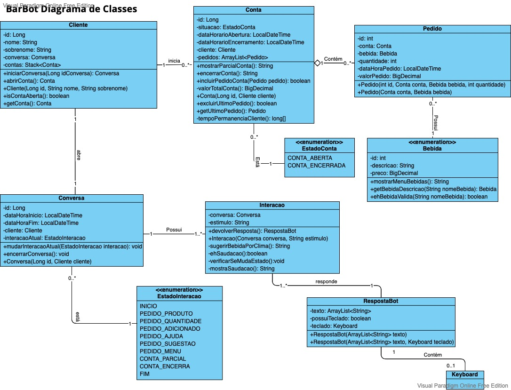
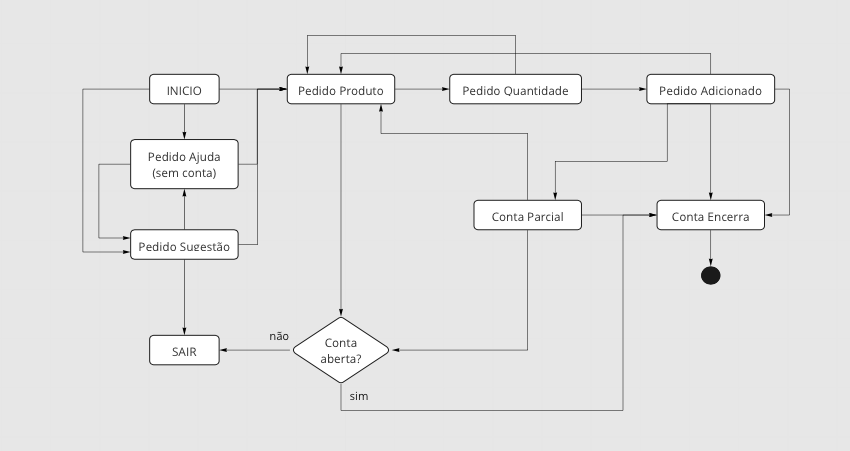
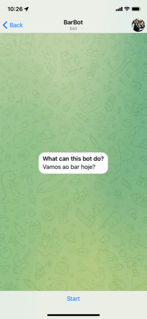

# BarBot 🤵‍♂️🤖🍻🍻😄

## 🎯 Objetivo

BarBot é um chatbot Telegram que facilita o pedido de um cliente em um bar. Como um garçom virtual, o BarBot sugere algum pedido de acordo com o clima do local (Brasília), retira pedido do cliente, mostra parcial da conta e encerra a conta. 

## 📐 Diagrama de classes

## 📐 Diagrama de Máquina de Estados

## 📱 Print de telas da aplicação

## 🛠️ Tecnologias utilizadas

- Linguagem Java (versão 1.8)
- Biblioteca Java Telegram Bot API [https://github.com/pengrad/java-telegram-bot-api]
- Spring framework (Chamada API Clima - Openweather)
- Maven (Gerenciador de dependências)
- JUnit 5 (Testes automatizados)
- GIT (Controle de versão)
- Eclipse (IDE)

## ⚙️ Como abrir e rodar o projeto
1. Clonar projeto do GitHub:
~~~bash
git clone https://github.com/AlexDamiao86/Java-Bot.git
cd Java-bot
~~~
2. Abrir o projeto na sua IDE de preferência.
3. Criar seu Bot através do BotFather do Telegram e configurar a constante MEU_BOT no arquivo src/telegram_bot/Main.java com o Token recebido. (https://core.telegram.org/bots). [^1]
[^1]: Pode ser utilizado o @BarWaiterBot que possui o token informado na classe Main.java. 
4. Criar seu Token para utilizar a API de clima do [OpenWeatherMap](https://openweathermap.org) para consultar a temperatura do local (que permite sugerir bebida no início da conversa) e configurar a constante TOKEN no arquivo src/api_clima/ClimaAPI.java. [^2]
[^2]: Mantemos um token informado na classe ClimaAPI.java para avaliação do projeto. 
5. Executar o arquivo Main.java. 
6. Abrir o Bot através do Telegram no celular (recomendamos utilizar o celular para ser possível visualizar os botões mostrados durante as interações).

## 👨🏽‍💻👩🏽‍💻 Desenvolvedores 

| [ Alexandre Damião Mendonça Maia](https://github.com/AlexDamiao86) |  [ Fabio Ferreira dos Santos](https://github.com/Mestre-Bio) |  [ Karina Fávero dos Santos](https://github.com/KarinaFSantos) | [ Luis Bernardo Souza Braga](https://github.com/LuBerBraga) |  [ Vanessa Santos e Silva](https://github.com/VANESSA-SS) |
| :---: | :---: | :---: | :---: | :---: |

>
>Projeto realizado como requisito para conclusão da disciplina Java Platform do MBA Full Stack Development - FIAP 2022
>Prof. Rafael Matsuyama (https://github.com/rafaelmatsuyama)

